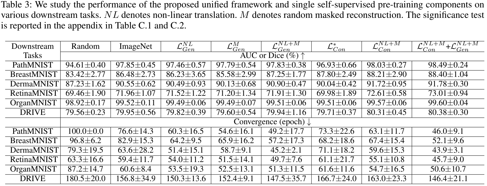

# Synergizing Generative and Contrastive Learning for Self-Supervised Pre-Training in Medical Image Analysis
We are the first to explore the low diversity of contrastive learning in medical image analysis and improve it by generative proxy tasks.

We propose a self-supervised pre-training framework that improves the slow convergence of contrastive learning by synergizing generative and contrastive learning.

Our work unlocks the power of contrastive learning in medical image analysis, and outperforms other SOTA self-supervised and ImageNet-based supervised pre-training methods on various medical image analysis tasks.

Additionally, semi-supervised experiments further show the better label-efficiency of our proposed framework.

<p align="center"></p>

In this repository we release multiple models from our paper as well as the code to fine-tuning the released models in desired downstream tasks.  

(<b>** We have to emphasize that all released codes are anonymized and all links are publicly available. We provide detailed materials so that reviewers and readers can better understand our work. There is no intentional violation of the double-blind review principle. **</b>)

## Publication
<b>Anonymous </b> 

[Paper](https://arxiv.org) | [Code](https://github.com) | [Poster](https://github.com) | [Slides](https://github.com) | [Presentation](https://github.com) 

(Invalid links and we will update them after acceptance.)

## Major results from our work
1. **The proposed MAGICAL achieved the best performance among all self-supervised learning methods and ImageNet-based supervised SOTA methods on all tasks. Results demonstrated the performance superiority and robustness of our work. Therefore, MAGICAL provided a more promising preferred initialization alternative for most medical image analysis tasks, especially those without annotations.**

<p align="center"></p>


2. **Contrastive learning with generative proxy tasks outperformed traditional ones ($\mathcal L_{Con}^{NL+M}>\mathcal L_{Con}^{*}$), demonstrating the effectiveness of generative proxy tasks in improving contrastive learning. 
Results demonstrated that our work unlocked the power of contrastive learning in medical image analysis. The whole framework achieved the best performance and convergence after synergizing contrastive and generative learning ($\mathcal L_{Con}^{NL+M}$+$\mathcal L_{Gen}^{NL+M}>\mathcal L_{Con}^{NL+M}$ and $>\mathcal L_{Gen}^{NL+M}$), demonstrating the effectiveness of cooperation between generative and contrastive learning.**

<p align="center"></p>


3. **MAGICAL can mitigate the lack of annotations, resulting in a more label-efficient deep learning in medical image analysis. MAGICAL can be fine-tuned on a few labeled datasets to achieve comparable performance to the full-labeled dataset.**

<p align="center"></p>
<p align="center"></p>

## Packages Installation
Clone the repository and install dependencies using the following command:
```bash
$ cd Paper\ ID\ 121\ -\ code/
$ pip install -r requirements.txt
```

## Model Implementation
In this paper, we evaluate 19 pre-trained ResNet50 models, including: 1 supervised ImageNet model, 17 self-supervised models, and our proposed model. To download and prepare all models in the same format, run:

```bash
python download_and_prepare_models.py
```

**Note 1**: For SimCLR-v1 and SimCLR-v2, the TensorFlow checkpoints need to be downloaded manually (using the links in the table below) and converted into PyTorch format (using https://github.com/tonylins/simclr-converter and https://github.com/Separius/SimCLRv2-Pytorch, respectively).

**Note 2**: For converting BYOL, you need to install some extra packages by running:
```
pip install jax jaxlib dill git+https://github.com/deepmind/dm-haiku
```

**Note 3**: For Model Genesis, you need to download the pre-trained model manually due to license.
(https://github.com/MrGiovanni/ModelsGenesis/tree/master/pytorch)

( p.s. You also can download the pretrained models used in our paper as follows. Save them to `./pretrained_models` directory.)

<table><tbody>
<!-- START TABLE -->
<!-- TABLE HEADER -->
 <td align="center">Category</th>
<td align="center">Backbone</th>
<td align="center">Training Datasets</th>
<td align="center">Training Objectives</th>
<td align="center">Models</th>

<!-- TABLE BODY -->
 <tr >
  <td align="center">Supervised pre-training</td>
<td align="center">ResNet50</td>

<td align="center">ImageNet</td>
<td align="center">Supervised</td>   
<td align="center">torchvision.models.resnet50 (pretrained=True)</td>

 <tr >
  <td rowspan = "16" align="center">Self-supervised pre-training</td>
<td align="center">ResNet50</td>

<td align="center">ImageNet</td>
<td align="center"><a href="https://arxiv.org/abs/2103.03230">Barlow Twins</a></td>   
<td align="center"><a href="https://dl.fbaipublicfiles.com/barlowtwins/ep1000_bs2048_lrw0.2_lrb0.0048_lambd0.0051/resnet50.pth">download</a></td>

</tr>
 <tr> 
 <td align="center">ResNet50</td>

<td align="center">ImageNet</td>
<td align="center"><a href="https://arxiv.org/abs/2006.09882">SwAV</a></td>  
<td align="center"><a href="https://dl.fbaipublicfiles.com/deepcluster/swav_800ep_pretrain.pth.tar">download</a></td>
 </tr>
 
 <tr> 
<td align="center">ResNet50</td>

<td align="center">ImageNet</td>
<td align="center"><a href="https://arxiv.org/abs/2006.09882">DeepCluster-v2</a></td>   
<td align="center"><a href="https://dl.fbaipublicfiles.com/deepcluster/deepclusterv2_800ep_pretrain.pth.tar">download</a></td>
 </tr>
 
  <tr> 
<td align="center">ResNet50</td>

<td align="center">ImageNet</td>
<td align="center"><a href="https://arxiv.org/abs/2006.09882">Sela-v2</a></td>   
<td align="center"><a href="https://dl.fbaipublicfiles.com/deepcluster/selav2_400ep_pretrain.pth.tar">download</a></td>
 </tr>
 
 <tr> 
<td align="center">ResNet50</td>

<td align="center">ImageNet</td>
<td align="center"><a href="https://arxiv.org/abs/1805.01978">InsDis</a></td>   
<td align="center"><a href="https://www.dropbox.com/sh/87d24jqsl6ra7t2/AACcsSIt1_Njv7GsmsuzZ6Sta/InsDis.pth">download</a></td>
 </tr>
 
  <tr> 
<td align="center">ResNet50</td>

<td align="center">ImageNet</td>
<td align="center"><a href="https://arxiv.org/abs/1911.05722">MoCo-v1</a></td>   
<td align="center"><a href="https://dl.fbaipublicfiles.com/moco/moco_checkpoints/moco_v1_200ep/moco_v1_200ep_pretrain.pth.tar">download</a></td>
 </tr>
 
 <tr> 
<td align="center">ResNet50</td>

<td align="center">ImageNet</td>
<td align="center"><a href="https://arxiv.org/abs/2003.04297">MoCo-v2</a></td>   
<td align="center"><a href="https://dl.fbaipublicfiles.com/moco/moco_checkpoints/moco_v2_800ep/moco_v2_800ep_pretrain.pth.tar">download</a></td>
 </tr>
 
  <tr> 
<td align="center">ResNet50</td>

<td align="center">ImageNet</td>
<td align="center"><a href="https://arxiv.org/abs/2003.04297">MoCo-v3</a></td>   
<td align="center"><a href="https://dl.fbaipublicfiles.com/moco-v3/r-50-300ep/r-50-300ep.pth.tar.tar">download</a></td>
 </tr>
 
 <tr> 
<td align="center">ResNet50</td>
<td align="center">ImageNet</td>
<td align="center"><a href="https://arxiv.org/abs/2005.04966">PCL-v1</a></td>   
<td align="center"><a href="https://storage.googleapis.com/sfr-pcl-data-research/PCL_checkpoint/PCL_v1_epoch200.pth.tar">download</a></td>
 </tr>
 
  <tr> 
<td align="center">ResNet50</td>

<td align="center">ImageNet</td>
<td align="center"><a href="https://arxiv.org/abs/2005.04966">PCL-v2</a></td>   
<td align="center"><a href="https://storage.googleapis.com/sfr-pcl-data-research/PCL_checkpoint/PCL_v2_epoch200.pth.tar">download</a></td>
 </tr>
 
 <tr> 
<td align="center">ResNet50</td>

<td align="center">ImageNet</td>
<td align="center"><a href="https://arxiv.org/abs/2002.05709">SimCLR-v1</a></td>   
<td align="center"><a href="https://storage.cloud.google.com/simclr-gcs/checkpoints/ResNet50_1x.zip">download</a></td>
 </tr>
 
 <tr> 
<td align="center">ResNet50</td>

<td align="center">ImageNet</td>
<td align="center"><a href="https://arxiv.org/abs/2006.10029">SimCLR-v2</a></td>   
<td align="center"><a href="https://console.cloud.google.com/storage/browser/simclr-checkpoints/simclrv2/pretrained/r50_1x_sk0">download</a></td>
 </tr>
 
 <tr> 
<td align="center">ResNet50</td>

<td align="center">ImageNet</td>
<td align="center"><a href="https://arxiv.org/abs/2005.10243">InfoMin</a></td>   
<td align="center"><a href="https://www.dropbox.com/sh/87d24jqsl6ra7t2/AAAzMTynP3Qc8mIE4XWkgILUa/InfoMin_800.pth">download</a></td>
 </tr>
 
<tr> 
<td align="center">ResNet50</td>

<td align="center">ImageNet</td>
<td align="center"><a href="https://arxiv.org/abs/1912.01991">PIRL</a></td>   
<td align="center"><a href="https://github.com/HobbitLong/PyContrast/blob/master/pycontrast/docs/MODEL_ZOO.md">download</a></td>
 </tr>
 
 <tr> 
<td align="center">ResNet50</td>

<td align="center">ImageNet</td>
<td align="center"><a href="https://arxiv.org/abs/2006.07733">BYOL</a></td>   
<td align="center"><a href="https://storage.googleapis.com/deepmind-byol/checkpoints/pretrain_res50x1.pkl">download</a></td>
 </tr>
  <tr> 
<td colspan = "2" align="center">Our proposed framework</td>
<td align="center">MAGICAL</td>   
<td align="center">We will release them on GitHub.</td>
 </tr>
</tbody></table>

## Datasets
 More details of experiment protocols are provided in the paper and appendix.
Datasets can be downloaded from the following links. 

[LiTS](https://competitions.codalab.org/competitions/17094)

[CheXpert](https://stanfordmlgroup.github.io/competitions/chexpert/)

[DRIVE](https://drive.grand-challenge.org/) (pre-processed dataset can be downloaded from [here](https://github.com/clguo/SA-UNet/tree/844808189526afaf06296ba6c135b9c0ba67d70a))

[Montgomery](https://lhncbc.nlm.nih.gov/LHC-publications/pubs/TuberculosisChestXrayImageDataSets.html) 

[Shenzhen](https://lhncbc.nlm.nih.gov/LHC-publications/pubs/TuberculosisChestXrayImageDataSets.html)


[MedMNIST](https://medmnist.com)

## Models pre-training
1. Download the desired dataset or you can simply add any other dataset that you wish. Save them to `./datasets` directory.
2. Run:

For LiTS:
```bash
CUDA_VISIBLE_DEVICES=0,1,2,3 python pretrain-lcs.py --suffix <NAME> -b 12 --nb_class 1 --lr 1e-3
```
For CheXpert:
```bash
CUDA_VISIBLE_DEVICES=0,1,2,3 python pretrain-dxc.py --suffix <NAME> -b 32 --nb_class 1 --lr 2e-4
```
For DRIVE:
```bash
CUDA_VISIBLE_DEVICES=0,1,2,3 python pretrain-vfs.py --suffix <NAME> -b 16 --nb_class 3 --lr 1e-3
```
For Montgomery:
```bash
CUDA_VISIBLE_DEVICES=0,1,2,3 python pretrain-lxs.py --suffix <NAME> -b 16 --nb_class 1 --lr 1e-3
```
For Shenzhen:
```bash
CUDA_VISIBLE_DEVICES=0,1,2,3 python pretrain-txc.py --suffix <NAME> -b 24 --nb_class 1 --lr 2e-4
```
For MedMNIST:
```bash
CUDA_VISIBLE_DEVICES=0,1,2,3 python pretrain-medmnist.py --suffix <NAME>  --data_set dermaMNIST --nb_class 3 -b 128 --lr 1e-3
CUDA_VISIBLE_DEVICES=0,1,2,3 python pretrain-medmnist.py --suffix <NAME>  --data_set retinaMNIST --nb_class 3 -b 128 --lr 1e-3
CUDA_VISIBLE_DEVICES=0,1,2,3 python pretrain-medmnist.py --suffix <NAME>  --data_set organaMNIST --nb_class 3 -b 128 --lr 1e-3
CUDA_VISIBLE_DEVICES=0,1,2,3 python pretrain-medmnist.py --suffix <NAME>  --data_set breastMNIST --nb_class 3 -b 128 --lr 1e-3
CUDA_VISIBLE_DEVICES=0,1,2,3 python pretrain-medmnist.py --suffix <NAME>  --data_set pathMNIST --nb_class 3 -b 128 --lr 1e-3
```
## Fine-tuing of pre-trained models on downstream tasks
1. Download the desired pre-trained models from the above-mentioned links or pre-train from yourself.
2. Download the desired dataset or you can simply add any other dataset that you wish.
For the classificatin tasks, we have provided data splits in the dataset directory.
For the segmentation tasks, you need to put the train, test, and validation sets into separate folders.  
For each of train, test, and validation sets, a text file including images and labels information is recommended, or you may find them in the dataset website.  
Otherwise, we used the ''train_test_split(imgs_list, test_size=0.2, random_state=42)'' split dataset. (from sklearn.model_selection import train_test_split)
3. For classification tasks, run the following command by the desired parameters. For example, to finetune BarlowTwins on retinaMNIST, run:
```bash
python main_classification.py --data_set retinaMNIST  \
--init barlowtwins \
--proxy_dir path/to/pre-trained-model \
-- epochs 100 \
-lr 1e-3 \
--run <NAME> \
--patience 30 \
--annotation_percent 100 \
--train_batch_size 32 \
--trial 10
```
4. For segmentation tasks, run the following command by the desired parameters. For example, to finetune BarlowTwins on DRIVE, run:
```bash
python main_segmentation.py --data_set DRIVE  \
--proxy_dir path/pretrained_models/ \
--init barlowtwins \
-- epochs 200 \
-lr 1e-2 \
--run <NAME>  \
--patience 30 \
--annotation_percent 100 \
--train_batch_size 32 \
--trial 10
```
## Citation
Anonymous
## Acknowledgement
Anonymous
## Reference
Anonymous
## License
Anonymous

#### ** We hope that in the light of our study, the medical imaging and computer vision community will benefit from the use of more powerful pre-trained models than conventional supervised models pre-trained on the ImageNet dataset. **