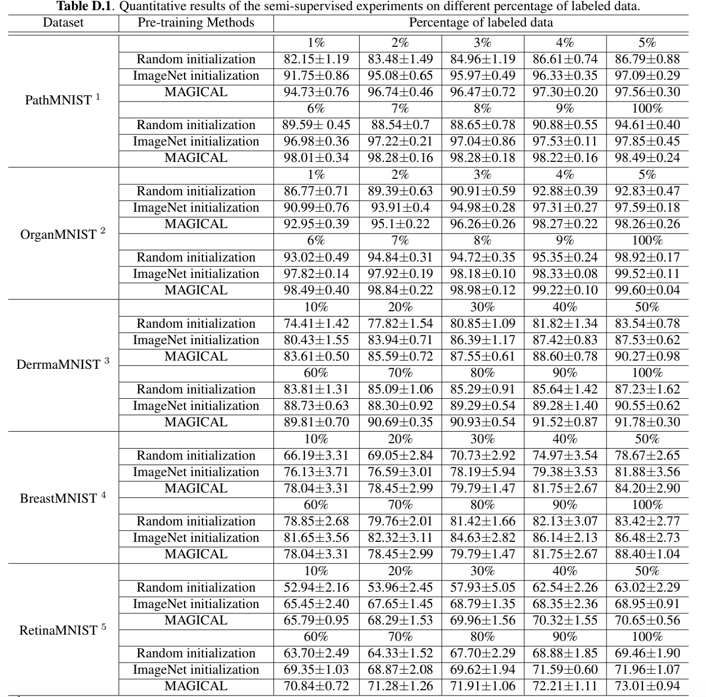

# Semi-supervised experiments for labeling-efficient learning
In this folder we release experimental protocols and results of semi-supervised experiments. 

We conducted semi-supervised learning experiments on dif-ferent percentages of labeled data. The dataset and experi-mental protocol were the same as the ablation study.

<br/>
<p align="center"></p>
<br/>

<table><tbody>
<!-- START TABLE -->
<!-- TABLE HEADER -->
<td align="center">dataset</th>
<td align="center">pretraining methods</th>
<td colspan = "10" align="center">logs of different percentage labeled data</th>

<!-- TABLE BODY -->

 <tr >
<td rowspan = "3" align="center">Path MNIST</td>
<td align="center">Random</td>
<td align="center"></td>   
<td align="center">2%</td>  
<td align="center">3%</td>
<td align="center">4%</td>   
<td align="center">5%</td>  
<td align="center">6%</td>   
<td align="center">7%</td>  
<td align="center">8%</td>
<td align="center">9%</td>   
<td align="center">100%</td>   
</tr>
 <tr>
<td align="center">ImageNet</td>
<td align="center">1%</td>   
<td align="center">2%</td>  
<td align="center">3%</td>
<td align="center">4%</td>   
<td align="center">5%</td>  
<td align="center">6%</td>   
<td align="center">7%</td>  
<td align="center">8%</td>
<td align="center">9%</td>   
<td align="center">100%</td> 
</tr>
 <tr>
<td align="center">MAGICAL</td>
<td align="center">1%</td>   
<td align="center">2%</td>  
<td align="center">3%</td>
<td align="center">4%</td>   
<td align="center">5%</td>  
<td align="center">6%</td>   
<td align="center">7%</td>  
<td align="center">8%</td>
<td align="center">9%</td>   
<td align="center">100%</td>  
</tr>
<tr >
<td rowspan = "3" align="center">Organ MNIST</td>

<td align="center">Random</td>
<td align="center">1%</td>   
<td align="center">2%</td>  
<td align="center">3%</td>
<td align="center">4%</td>   
<td align="center">5%</td>  
<td align="center">6%</td>   
<td align="center">7%</td>  
<td align="center">8%</td>
<td align="center">9%</td>   
<td align="center">100%</td>   
</tr>
 <tr>
<td align="center">ImageNet</td>
<td align="center">1%</td>   
<td align="center">2%</td>  
<td align="center">3%</td>
<td align="center">4%</td>   
<td align="center">5%</td>  
<td align="center">6%</td>   
<td align="center">7%</td>  
<td align="center">8%</td>
<td align="center">9%</td>   
<td align="center">100%</td> 
</tr>
 <tr>
<td align="center">MAGICAL</td>
<td align="center">1%</td>   
<td align="center">2%</td>  
<td align="center">3%</td>
<td align="center">4%</td>   
<td align="center">5%</td>  
<td align="center">6%</td>   
<td align="center">7%</td>  
<td align="center">8%</td>
<td align="center">9%</td>   
<td align="center">100%</td>  
<tr >
<td rowspan = "3" align="center">Derma MNIST</td>

<td align="center">Random</td>
<td align="center">10%</td>   
<td align="center">20%</td>  
<td align="center">30%</td>
<td align="center">40%</td>   
<td align="center">50%</td>  
<td align="center">60%</td>   
<td align="center">70%</td>  
<td align="center">80%</td>
<td align="center">90%</td>   
<td align="center">100%</td>   
</tr>
 <tr>
<td align="center">ImageNet</td>
<td align="center">10%</td>   
<td align="center">20%</td>  
<td align="center">30%</td>
<td align="center">40%</td>   
<td align="center">50%</td>  
<td align="center">60%</td>   
<td align="center">70%</td>  
<td align="center">80%</td>
<td align="center">90%</td> 
<td align="center">100%</td> 
</tr>
 <tr>
<td align="center">MAGICAL</td>
<td align="center">10%</td>   
<td align="center">20%</td>  
<td align="center">30%</td>
<td align="center">40%</td>   
<td align="center">50%</td>  
<td align="center">60%</td>   
<td align="center">70%</td>  
<td align="center">80%</td>
<td align="center">90%</td>  
<td align="center">100%</td>  
</tr>
<tr >
<td rowspan = "3" align="center">Breast MNIST</td>

<td align="center">Random</td>
<td align="center">10%</td>   
<td align="center">20%</td>  
<td align="center">30%</td>
<td align="center">40%</td>   
<td align="center">50%</td>  
<td align="center">60%</td>   
<td align="center">70%</td>  
<td align="center">80%</td>
<td align="center">90%</td>   
<td align="center">100%</td>   
</tr>
 <tr>
<td align="center">ImageNet</td>
<td align="center">10%</td>   
<td align="center">20%</td>  
<td align="center">30%</td>
<td align="center">40%</td>   
<td align="center">50%</td>  
<td align="center">60%</td>   
<td align="center">70%</td>  
<td align="center">80%</td>
<td align="center">90%</td> 
<td align="center">100%</td> 
</tr>
 <tr>
<td align="center">MAGICAL</td>
<td align="center">10%</td>   
<td align="center">20%</td>  
<td align="center">30%</td>
<td align="center">40%</td>   
<td align="center">50%</td>  
<td align="center">60%</td>   
<td align="center">70%</td>  
<td align="center">80%</td>
<td align="center">90%</td>  
<td align="center">100%</td>  
</tr>
<tr >
<td rowspan = "3" align="center">Retina MNIST</td>

<td align="center">Random</td>
<td align="center">10%</td>   
<td align="center">20%</td>  
<td align="center">30%</td>
<td align="center">40%</td>   
<td align="center">50%</td>  
<td align="center">60%</td>   
<td align="center">70%</td>  
<td align="center">80%</td>
<td align="center">90%</td>   
<td align="center">100%</td>   
</tr>
 <tr>
<td align="center">ImageNet</td>
<td align="center">10%</td>   
<td align="center">20%</td>  
<td align="center">30%</td>
<td align="center">40%</td>   
<td align="center">50%</td>  
<td align="center">60%</td>   
<td align="center">70%</td>  
<td align="center">80%</td>
<td align="center">90%</td>  
<td align="center">100%</td> 
</tr>
 <tr>
<td align="center">MAGICAL</td>
<td align="center">10%</td>   
<td align="center">20%</td>  
<td align="center">30%</td>
<td align="center">40%</td>   
<td align="center">50%</td>  
<td align="center">60%</td>   
<td align="center">70%</td>  
<td align="center">80%</td>
<td align="center">90%</td>  
<td align="center">100%</td>  
</tr>
<tr>
</tbody></table>

## Fine-tuing of pre-trained models on different percentages of labeled data
1. For classification tasks, run the following command. For example, to finetune BarlowTwins on retinaMNIST with 50% labeled data, run:
```bash
python main_classification.py --data_set retinaMNIST  \
--init barlowtwins \
--proxy_dir path/to/pre-trained-model \
-- epochs 100 \
-lr 1e-3 \
--run <NAME> \
--patience 30 \
--train_batch_size 32 \
--annotation_percent 50 \
--trial 10
```
2. For segmentation tasks, run the following command by the desired parameters. For example, to finetune BarlowTwins on DRIVE, run:
```bash
python main_segmentation.py --data_set DRIVE  \
--proxy_dir path/pretrained_models/ \
--init barlowtwins \
-- epochs 200 \
-lr 1e-2 \
--run <NAME>  \
--patience 30 \
--train_batch_size 32 \
--trial 10
```
## Citation
Anonymous
## Acknowledgement
Anonymous
## Reference
Anonymous
## License
Anonymous

#### We hope that in the light of our study, the medical imaging and computer vision community will benefit from the use of more powerful pre-trained models than conventional supervised models pre-trained on the ImageNet dataset.